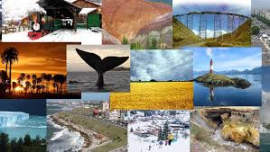

<!DOCTYPE html>
<html>
  <head>
    <meta charset="UTF-8">
    <meta name="viewport" content="width=device-width">
    <title>Viajes o lugares </title>
    <link href="STYLE.CSS" rel="STYLESHEET" type="TEXT/CSS"/>
  </head>
  <body>
    <main>
      <h1>Viajes que me gustarian vistar</h1>
      <lo>
        <li>Barcelona</li>
        <li>Alemania</li>
        <li>Inglaterra</li>
        <li>Argentina</li>
        <figure>
            
            
            <a href="https://www.getyourguide.es/-l45/?cmp=ga&cq_src=google_ads&cq_cmp=15508194121&cq_con=136583721971&cq_term=barcelona%20turismo&cq_med=&cq_plac=&cq_net=g&cq_pos=&cq_plt=gp&campaign_id=15508194121&adgroup_id=136583721971&target_id=kwd-320361749&loc_physical_ms=1012108&match_type=e&ad_id=569192065905&keyword=barcelona%20turismo&ad_position=&feed_item_id=&placement=&device=c&partner_id=CD951&gad_source=1&gclid=EAIaIQobChMI3oO2yOrQiQMVVrBaBR0bUzSqEAAYASAAEgJYg_D_BwE">Las 10 mejores cosas que hacer - Barcelona</a>
            
        </figure>
      </lo>
    </main>
  </body>
  </body>
</html>
